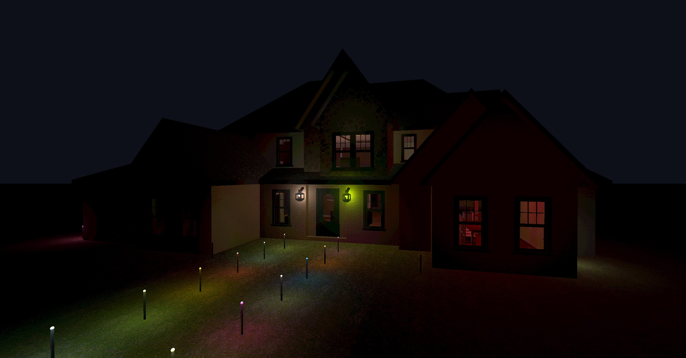

# Clustered Forward+ Render Pipeline

Jared Watrous (jwat2002@stanford.edu)

**The code in this repository is from an old repo of mine that will serve as a starting point for this project. See Technical Specs for dependencies.**

# Summary

I am going to implement a real-time 3D render pipeline with emphasis on support for a very large number of light sources. I will focus primarily on the render pipeline itself (e.g. going from geometry and light data to pixels on the screen), and will *not* worry about performance in other parts of the application (e.g. asset loading, event processing, etc.) I will start with the code base in this repository, which is taken from an old project of mine written in C++ and OpenGL that already handles scene graphs and basic asset loading. **This is an implementation-focused project.**

## Background

In real-time rendering applications, often the biggest bottleneck in shaders is dynamic lighting computations. A naive implementation could iterate over every light source in the pixel shader, but this grows linearly with the number of light sources in the scene, and when the number of light sources exceeds the memory accessible to the GPU, lights may need to be rendered in multiple passes. More sophisticated approaches attempt to mitigate this by removing redundant and unnecessary lighting computations, such as when light sources are negligible at a pixel due to sufficient attenuation, or when pixels will be occluded by other geometry later in the render pipeline. This project will target one of two approaches, depending on feasibility determined during implementation:

- Clustered Forward+ Rendering: Based on the original [Forward+](https://takahiroharada.wordpress.com/wp-content/uploads/2015/04/forward_plus.pdf) method and [clustered](https://www.cse.chalmers.se/~uffe/clustered_shading_preprint.pdf) methods, Clustered Forward+ Rendering subdivides the scene into 3D screen-space tiles ("screen-space" meaning they are aligned to the camera's frustum), and only computes a light source in tiles which the light source significantly influences. To my understanding, methods in this family are typically preferred in modern rendering pipelines.

- [Deferred Rendering](https://www.researchgate.net/profile/Jonathan_Thaler2/publication/323357208_Deferred_Rendering/links/5a8fce31aca272140560aaad/Deferred-Rendering.pdf): Deferred rendering processes occlusions first by rendering the entire scene to a "G-buffer", containing colors/normals/etc. for each pixel, then renders all lights afterwards. Although very effective, this method has high memory overhead, can make antialiasing difficult, and typically has limited (if any) support for transparent objects in the deferred pass.

**In this project,** I will prioritize Clustered Forward+ Rendering, but due to its (geometric) complexity, I *may* fall back to Deferred Rendering (see "Risks" section below). Note that this project only focuses on dynamic light sources, not static lights (which would often be baked into unchanging light/shadow maps.)

**Extension:** Note that shadows are a separate feature that is somewhat detached from the pipeline architecture defined above. I will work on shadow rendering if I have time, but it is not a priority.

## Inputs and Outputs

Inputs:

- A scene description, including geometry assets and light sources. For simplicity, the scene description will be hard-coded into the C++ application and will load external asset files
- Optionally user input (e.g. camera controls)

Outputs:

- A fully rendered scene displayed in a windowed application at a reasonable framerate (see Deliverables for the meaning of "reasonable")

# Task List

1. Adapt this old repository to work for this project
2. Implement (Clustered) Forward+ rendering as a `RenderPipeline` child class (just the lighting computations)
3. Construct a demo scene using CC0 assets (e.g. from [PolyHaven](https://polyhaven.com/)) and add many light sources (this can be done in Blender)
4. Evaluate performance (e.g. framerate) for different numbers of light sources on typical household hardware
5. (Extension) Add shadow support if time permits

## Deliverables

- A compiled application and demo scene
- Performance benchmarks for different light sources on typical household hardware (e.g. my computer)
- I have set an (arbitrary) goal of 100 dynamic light sources for the benchmark. I hope to reach 30 fps on mid-range hardware (a laptop NVIDIA GTX 1660) and 60fps on high-end hardware (a desktop NVIDIA RTX 3080). I can achieve this performance (without shadows), I will consider the project a success.

## Risks & Help

The biggest risk is if I can't manage to perfect the clustering process due to the complex computational geometry problems involved. For this reason, I propose Deferred Rendering as a fallback architecture that should be easier to implement. I shouldn't need any special compute resources, but I may reach out to course staff to ask for suggested readings.

# Technical Specs

- This project will be written in C++17 using OpenGL 3.3+ (the minimum OpenGL version is STC)
- I will target the Windows platform because that is what I have available. I will try to offer a Linux build option but cannot guarantee it will work. I will not be able to offer build support for macOS

### Dependencies

- [assimp](https://github.com/assimp/assimp)
- [GLEW](https://github.com/nigels-com/glew)
- [GLFW](https://github.com/glfw/glfw)
- [GLM](https://github.com/g-truc/glm)
- [stb_image.h](https://github.com/nothings/stb/blob/master/stb_image.h)

---

# Render Engine


*House model from [TurboSquid](https://www.turbosquid.com/3d-models/simple-house-with-interior-model-1747451)*

This render engine is a high-level abstraction that lets the user create a bare-bones description of the scene using references to on-disk asset files. If desired, the user can create the scene entirely in dedicated software and load it as a single asset. For example, the demo scene above can be created with just a few lines:

```cpp
RenderEngine engine;

int main(int argc, char* argv[]) {

    Ref<Scene> scene = engine.createScene();
    engine.setActiveScene(scene);
    scene->backgroundColor = glm::vec3(0.05f, 0.06f, 0.1f);

    Ref<GameObject> house = Assets::importObject(engine, "./samples/assets/house/house.gltf");
    scene->addObject(house);

    // Boilerplate: create a controllable camera
    Ref<GO_Camera> camera = engine.createObject<GO_Camera>();
    scene->addObject(camera);
    camera->setPerspective(glm::radians(70.0f), 1280.0f / 720.0f, 0.1f, 100.0f);
    camera->addComponent<Motion>();
    camera->addComponent<KeyboardController>();
    camera->addComponent<MouseRotation>();
    camera->addComponent<ApplyMotion>();

    engine.launch("House Demo", 1280, 720, false);
    return 0;
}
```

The engine also offers the user freedom to modify any element of the scene graph. For example, the following snippet dims all the light sources in the "house" asset by a factor of `0.1` by running a recursive lambda over its children:

```cpp
std::function<void(Ref<GameObject>)> dim_the_lights = [&dim_the_lights](Ref<GameObject> root) {
    if (GO_Light* light = root.cast<GO_Light>())
        light->color *= 0.1f;
    for (auto child : root->getChildren())
        dim_the_lights(child);
};
dim_the_lights(house);
```

